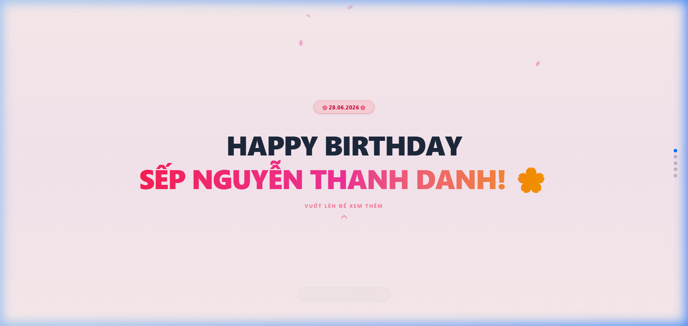
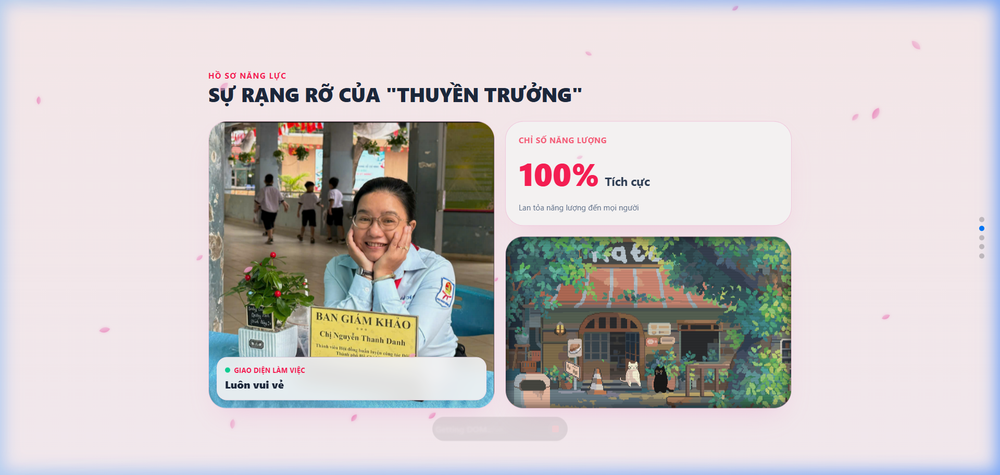
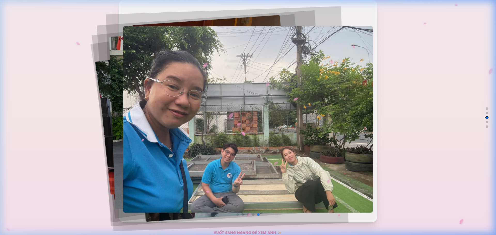
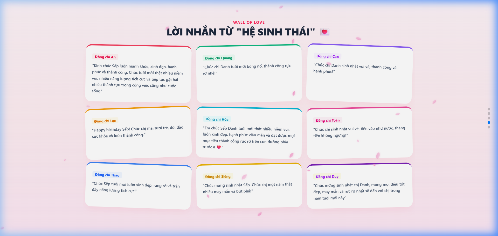
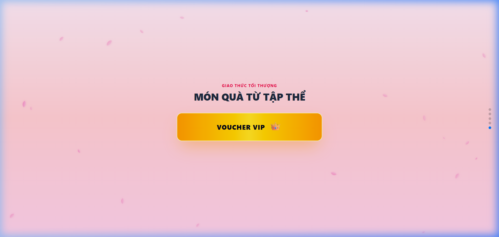

# 🌸 Happy Birthday Sếp Nguyễn Thanh Danh! 🌸

Chào mừng bạn đến với dự án **Happy Birthday Chị Danh**! Đây là một trang web tương tác được thiết kế vô cùng sinh động, hiện đại và tràn đầy cảm xúc để chúc mừng sinh nhật Sếp Nguyễn Thanh Danh (28/06/2026) từ tập thể 9 thành viên trong nhóm.

Dự án được xây dựng trên nền tảng **Vite** kết hợp với hiệu ứng chuyển trang dạng TikTok mượt mà, phong cách thiết kế Bento Grid thời thượng, hiệu ứng hoa rơi lãng mạn và âm nhạc sôi động.

## 🔗 Demo Trực Tuyến

Trang web đã được xuất bản và chạy trực tuyến tại GitHub Pages:
👉 **[https://adcantcarry.github.io/happy-birthday/](https://adcantcarry.github.io/happy-birthday/)**

---

## 🚀 Tính Năng Nổi Bật

1. **Hiệu ứng Hoa Anh Đào Rơi**: Hoa anh đào bay nhẹ nhàng xuyên suốt trang web tạo không khí thơ mộng, dễ chịu.
2. **Slide 1 - Lời Chào Ấn Tượng**: Tiêu đề rực rỡ với dải gradient màu pastel kèm hiệu ứng vuốt lên trực quan để khám phá.
3. **Slide 2 - Bento Grid (Hồ Sơ Năng Lực)**:
   - Hiển thị ảnh của Sếp với hiệu ứng zoom nhẹ khi di chuột.
   - Thống kê chỉ số năng lượng tích cực 100%.
   - Màn hình giả lập CRT hiển thị ảnh động Pixel Garden hoài cổ cực nghệ.
4. **Slide 3 - Album Kỷ Niệm**: Trình chiếu ảnh kỷ niệm dạng trượt ngang 3D (Cards Effect) tự động chuyển đổi.
5. **Slide 4 - Bức Tường Lời Nhắn (Wall of Love)**: 9 mảnh giấy note ghim màu sắc ghi lại những lời chúc chân thành, vui vẻ từ 9 đồng chí trong team. Các thẻ note tự động xoay nhẹ và phóng to sinh động khi rê chuột qua.
6. **Slide 5 - Món Quà VIP Đặc Biệt**: 
   - Nút bấm nhận quà phủ nhũ vàng sang trọng.
   - Khi nhấn nút: Kích hoạt pháo hoa giấy (confetti) bùng nổ, nhạc nền chuyển sang bài hát sôi động và dàn 10 lon Heineken Silver xếp lớp mượt mà xuất hiện ở dưới.

---

## 📸 Ảnh Chụp Giao Diện (Screenshots)

Dưới đây là một số hình ảnh thực tế chụp từ giao diện của trang web đang chạy trực tuyến:

### 🌸 Slide 1 - Lời Chào Mừng Chúc Mừng Sinh Nhật Sếp


### 📊 Slide 2 - Bento Grid & Chỉ Số Năng Lượng Tích Cực


### 📸 Slide 3 - Trình Chiếu Album Kỷ Niệm 3D


### 💌 Slide 4 - Bức Tường Lời Nhắn Từ 9 Thành Viên


### 👑 Slide 5 - Khui Quà VIP & Confetti Ăn Mừng


---

## 🛠️ Công Nghệ Sử Dụng

- **Vite**: Công cụ build nhanh và nhẹ cho Modern Web.
- **Tailwind CSS**: Thiết kế giao diện responsive và phối màu tinh tế.
- **Swiper JS**: Xử lý hiệu ứng lướt mượt mà theo chiều dọc (kiểu TikTok) và chiều ngang (kiểu album ảnh 3D).
- **Canvas-Confetti**: Tạo hiệu ứng pháo hoa ăn mừng rực rỡ khi mở quà.
- **HTML5 Audio API**: Quản lý nhạc nền tự động chuyển đổi thông minh khi di chuyển giữa các phân đoạn.

---

## 📁 Cấu Trúc Thư Mục Dự Án

```text
happy-birthday/
├── wwwroot/                 # Chứa tài nguyên tĩnh của dự án
│   ├── audio/               # Nhạc nền (happy-birthday.mp3, benz.mp3)
│   └── images/              # Ảnh kỷ niệm & giao diện (1.jpg, 2.jpg,..., bia.png, pixel-garden.gif)
├── src/                     # Mã nguồn chính
│   ├── assets/              # Tài sản tĩnh cục bộ (nếu có)
│   ├── main.js              # File JS khởi chạy cấu hình chính
│   └── style.css            # File CSS tùy chỉnh
├── index.html               # Trang HTML chính (chứa toàn bộ giao diện và logic tương tác)
├── package.json             # Khai báo thư viện phụ thuộc và các câu lệnh chạy dự án
├── vite.config.js           # Cấu hình Vite & Tailwind CSS
└── README.md                # Tài liệu hướng dẫn này
```

---

## 💻 Hướng Dẫn Cài Đặt & Khởi Chạy

Để chạy dự án này trên máy tính của bạn, hãy làm theo các bước dưới đây:

### 1. Cài đặt các thư viện phụ thuộc
Mở terminal trong thư mục dự án và chạy lệnh:
```bash
npm install
```

### 2. Chạy dự án ở chế độ Phát Triển (Development)
Chạy lệnh sau để khởi tạo server local:
```bash
npm run dev
```
Sau đó, truy cập đường dẫn hiển thị trên terminal (thông thường là `http://localhost:5173`) để trải nghiệm trang web.

### 3. Biên dịch dự án (Build Production)
Khi muốn đóng gói mã nguồn để đưa lên hosting, chạy lệnh:
```bash
npm run build
```
Thư mục `dist` sau khi build xong sẽ chứa toàn bộ mã nguồn HTML, CSS, JS và tài nguyên đã được tối ưu hóa để sẵn sàng triển khai.

---

## ✍️ Hướng Dẫn Tùy Chỉnh Nội Dung

Dự án được thiết kế rất dễ tùy biến để bạn có thể thay đổi thông tin theo ý muốn:

### 1. Thay đổi ảnh của Sếp
- Chuẩn bị một bức ảnh chân dung đẹp.
- Đổi tên ảnh thành `chi_Danh.png` (hoặc `chi_Danh.jpg`).
- Copy và ghi đè vào thư mục `wwwroot/images/`.

### 2. Thay đổi ảnh trong Album Kỷ Niệm
- Chuẩn bị 5 bức ảnh kỷ niệm bất kỳ.
- Đặt tên lần lượt từ `1.jpg` đến `5.jpg`.
- Chép đè vào thư mục `wwwroot/images/`.

### 3. Chỉnh sửa lời chúc của các thành viên
- Mở file [index.html](file:///d:/CODE/Du_an/happy-birthday/index.html).
- Tìm đến khối mã dưới chú thích `<!-- ================= SLIDE 4: BỨC TƯỜNG 9 THÀNH VIÊN ================= -->`.
- Thay đổi tên và nội dung lời chúc trong các thẻ `<div class="note-card">`. Ví dụ:
  ```html
  <div class="note-card rotate-1" style="border-top-color: #f43f5e;">
    <span class="text-[11px] font-bold text-rose-600 bg-rose-50 px-2 py-0.5 rounded">Tên Thành Viên</span>
    <p class="text-xs text-slate-600 mt-2 font-medium leading-relaxed">"Lời chúc ý nghĩa tại đây..."</p>
  </div>
  ```

### 4. Thay đổi nhạc nền
- Thay đổi file nhạc chào mừng: Ghi đè file của bạn vào `wwwroot/audio/happy-birthday.mp3`.
- Thay đổi file nhạc khi bóc quà: Ghi đè file của bạn vào `wwwroot/audio/benz.mp3`.

---
Chúc bạn và tập thể có một ngày sinh nhật thật ấm áp và ý nghĩa cùng Sếp! 🎉🌸
